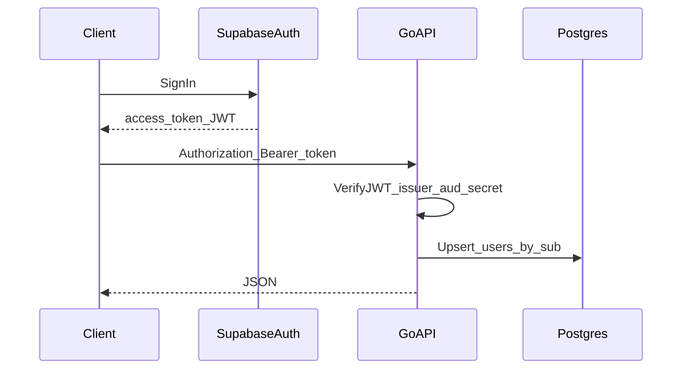

# Supabase auth and local users

## Overview

Add Supabase JWT verification on the Go API, a `users` table keyed by Supabase `sub`, and lazy provisioning on first authenticated request—no background sync from Supabase.

## Context

- Backend: Go, GORM + Postgres, custom migrations in `backend/internal/migrations/migrations.go`, routes wired in `backend/cmd/server/main.go`.
- Mobile: Expo app under `mobile/`.

## Target architecture

- **Supabase**: identity, sessions, refresh tokens, OAuth/email flows.
- **Your API**: validates **access token** JWT only (HS256 with JWT secret and/or RS256 via Supabase Auth JWKS); treats **`sub`** as the canonical user id.
- **Your DB**: one row per user; **created/updated on first (and subsequent) authenticated calls** via upsert—no sync jobs.

## Supabase project (dashboard)

- Enable desired providers under **Authentication → Providers** (email/OAuth).
- Record **JWT secret** (Settings → API) for server verification (HS256).
- Record **issuer** `iss` (typically `https://<project-ref>.supabase.co/auth/v1`) and confirm **`aud`** on a real token (often `authenticated`).
- Mobile uses **publishable key** + Project URL (public); **JWT secret stays server-only**.
- **Data API / exposing tables in Supabase Postgres is not required** for this architecture—the Go API owns app data in your own Postgres.

## Database: `users` table

Migration `0003_users` in `backend/internal/migrations/migrations.go`. Run via `go run ./cmd/migrate` from `backend/` or on server startup when `RUN_MIGRATIONS_ON_STARTUP` is not `false`.

| Column | Purpose |
|--------|---------|
| `id UUID PRIMARY KEY` | Equals JWT `sub` (Supabase user id) |
| `email TEXT` | From JWT when present |
| `email_verified BOOLEAN NOT NULL DEFAULT false` | From claim when present |
| `created_at` / `updated_at` | `TIMESTAMPTZ`, defaults + updates on upsert |

Display name or username columns can be added later if needed.

## Backend packages

| Location | Role |
|----------|------|
| `backend/internal/platform/auth` | `SUPABASE_JWT_SECRET` (optional if RS256-only with issuer URL), optional `SUPABASE_URL` / `SUPABASE_JWT_ISSUER` for `iss` and JWKS (`<issuer>/.well-known/jwks.json`). Bearer parsing, JWT verify HS256/RS256, `Principal` on `context`, `Middleware`. |
| `backend/internal/users` | GORM `User` model, store upsert from principal, `GET /me` handler. |
| `backend/cmd/server/main.go` | Wire verifier, user service, protected `/me`. Public routes (e.g. `GET /locations`) unchanged. |

Dependency: `github.com/golang-jwt/jwt/v5`.

## Configuration

**Backend** (`backend/.env.example`):

- `SUPABASE_JWT_SECRET` (required)
- `SUPABASE_JWT_ISSUER` or `SUPABASE_URL` (for `iss` validation)
- Optional `SUPABASE_JWT_AUDIENCE` (default check: `authenticated`)

**Mobile** (`mobile/.env.example`):

- `EXPO_PUBLIC_SUPABASE_URL`
- `EXPO_PUBLIC_SUPABASE_PUBLISHABLE_KEY`
- `EXPO_PUBLIC_API_BASE_URL`

Use HTTPS for bearer tokens in production.

## Mobile client

- `@supabase/supabase-js` + `expo-sqlite/localStorage/install` and `localStorage` for session persistence (Expo-recommended; avoids `@react-native-async-storage/async-storage` native bridge issues on some targets).
- After sign-in, `GET /me` with `Authorization: Bearer <access_token>` provisions the user row in your DB.
- Login/signup screens call Supabase Auth; successful login syncs via `lib/api.ts`.

## Testing

- `backend/internal/platform/auth`: JWT verify and middleware httptest.
- `backend/internal/users`: service tests with fake store.

## Security checklist

- Never ship JWT secret to the app.
- Do not trust client body for user id; only `sub` from verified JWT.
- Validate `exp`; rely on Supabase refresh on the client for renewal.

## Scope boundaries

- No Row Level Security on your separate Postgres for this flow.
- No webhook or cron to copy `auth.users`.

## Implementation checklist

- [x] Migration `0003_users`
- [x] `internal/platform/auth` (JWT + middleware)
- [x] `internal/users` (GORM store, service, `GET /me`)
- [x] Server wiring and `backend/.env.example`
- [x] Mobile Supabase client, env, login/signup, `/me` sync
- [x] Backend unit tests for auth and users service
