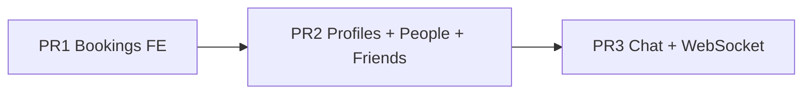

# Chat, Friends, and Social Presence

Roadmap for social features on top of the existing bookings API. Delivered in three PRs.

**Status:** PR 1 (mobile bookings) is implemented. PR 2 and PR 3 are planned.

## Context

The app today has **no social layer**: users are keyed by Supabase `sub` in `backend/internal/users/`, display names live in **Supabase metadata** (`mobile/app/profile/edit.tsx`), bookings exist in the backend but mobile booking UI was not wired until PR 1, and **check-in does not exist**. Messaging/WebSocket infra is also absent.

Confirmed decisions:

- **Friend activity (V1)** = confirmed **bookings only** (check-in later)
- **Messaging** = **WebSockets** via [coder/websocket](https://github.com/coder/websocket), messages persisted in Postgres
- **E2E encryption** = deferred
- **`SOCIAL_ENABLED`** = **true by default** (backend + `EXPO_PUBLIC_SOCIAL_ENABLED`); PR 1 bookings work is unaffected
- **Navigation** = new **People** tab; **Favorites tab stays** as its own route (currently empty stub)
- **Delivery** = **3 PRs** in strict order (see below)

---

## PR phases

### PR 1 — Bookings frontend (no social backend) — done

**Goal:** Replace placeholder booking UI with real API integration per `BOOKINGS_API.md`. No schema changes, no social flag needed.

**Shipped:**

- `mobile/lib/bookings.ts` — typed wrappers using `authFetch`
- `mobile/app/office/[id].tsx` — calendar booking modal, availability, reserve, user booked-day markers
- `mobile/app/profile/bookings.tsx` — list, cancel, pull-to-refresh, tap-through to office
- `STATIC_FILES_BASE_URL` in backend seed for location image URLs (default `http://localhost:8082`)

**Test plan:** Create booking, see it in profile list, cancel; verify busy/full states; verify 409 when booking two offices same day.

---

### PR 2 — Profiles, visibility, people, friends

**Goal:** Backend profile fields, public/private accounts, see who is booked at an office, find users, and (recommended) friend requests so PR 3 chat has a social graph.

#### Backend — migration `0009_user_profiles`

Extend `users`:

| Column | Type | Notes |
|--------|------|-------|
| `display_name` | `TEXT` | Backfill from email local-part for existing rows |
| `is_public` | `BOOLEAN DEFAULT false` | Public = searchable by name; anyone sees today's booking |
| `avatar_url` | `TEXT NULL` | Optional; defer if not needed for V1 |

#### Backend — migration `0010_friends` (recommended in PR 2)

- `friend_requests`: `id`, `from_user_id`, `to_user_id`, `status` (`pending` | `accepted` | `declined`), timestamps; unique partial index on pending pairs
- `friendships`: `user_a_id`, `user_b_id` (canonical `user_a_id < user_b_id`), unique constraint

> **Friends in PR 2 vs PR 3:** Friendships are required before messaging. Putting friends + inbox in PR 2 keeps PR 3 focused on chat/WS only.

#### Backend API — extend `backend/internal/users/`

| Method | Path | Purpose |
|--------|------|---------|
| GET | `/me` | Add `display_name`, `is_public` |
| PATCH | `/me` | Update `display_name`, `is_public` |
| GET | `/users/search?q=` | Public users only; `ILIKE` on `display_name` (min 2 chars) |
| POST | `/users/lookup-by-email` | Body `{ "email" }` → minimal card or 404 |
| GET | `/users/{id}` | Profile card (no email) |

#### Backend API — new `backend/internal/friends/` (PR 2)

| Method | Path | Purpose |
|--------|------|---------|
| POST | `/friends/requests` | `{ user_id }` or `{ email }` |
| GET | `/friends/requests/inbox` | Incoming `pending` |
| POST | `/friends/requests/{id}/accept` | |
| POST | `/friends/requests/{id}/decline` | |
| GET | `/friends` | Accepted friends list |

#### Backend API — visibility (PR 2)

| Method | Path | Purpose |
|--------|------|---------|
| GET | `/locations/{id}/bookings/visible?date=` | Confirmed bookings at location: **friends** + **public** users |

#### Feature flag (from PR 2 onward)

- `SOCIAL_ENABLED=true` by default in `backend/.env.example`
- `EXPO_PUBLIC_SOCIAL_ENABLED=true` in mobile env example
- When off: social routes return `404`; People tab hidden

#### Mobile — new **People** tab (do not touch Favorites)

Add `mobile/app/(tabs)/people.tsx` as a fourth tab. Keep `mobile/app/(tabs)/favorites.tsx` unchanged.

**People tab (PR 2):** friend inbox, user search, add by email, friends list.

**Profile edit:** public/private toggle via `PATCH /me`.

**Office page:** "People here" section via visible bookings endpoint.

---

### PR 3 — Chat + WebSocket

**Goal:** 1:1 messaging between friends, server-side storage, real-time delivery via `github.com/coder/websocket`.

**REST:** conversations list, message history, fallback send.

**WebSocket:** `GET /chat/ws` with JWT; hub broadcasts `message.new`, friend request events.

**Mobile:** Chats on People tab, `mobile/app/chat/[id].tsx`, `mobile/lib/chat.ts`, `mobile/lib/chat-ws.ts`.

---

## Deferred (out of scope)

| Item | Reason |
|------|--------|
| Check-in / live presence | No model yet; bookings suffice for V1 |
| E2E encryption | Deferred |
| Push notifications | WS + in-app only for V1 |
| Favorites tab content | Separate future feature |

---

## Testing checklist (by PR)

**PR 1**

- Reserve, list, cancel bookings; busy/full banners; 409 handling
- Tap booking in All Bookings → office detail

**PR 2**

- Public user searchable; private user addable by email
- Public/private toggle persists
- Office page shows public users + friends with bookings
- Friend request inbox: approve / decline

**PR 3**

- Non-friends cannot open conversation
- Friends message; recipient receives via WebSocket
- WS reconnect after app background
