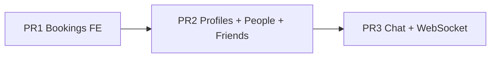
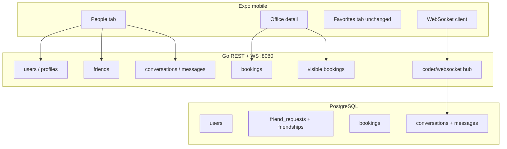

# Chat, Friends, and Social Presence — Implementation Plan

Exhaustive plan for adding social features to Connect Office. Work is split into **three PRs**; PR 1 and PR 2 are **done**. PR 3 (chat) is next.

---

## Table of contents

1. [Current state](#current-state)
2. [Product requirements](#product-requirements)
3. [Architecture decisions](#architecture-decisions)
4. [PR 1 — Mobile bookings (done)](#pr-1--mobile-bookings-done)
5. [PR 2 — Profiles, visibility, friends](#pr-2--profiles-visibility-friends)
6. [PR 3 — Chat and WebSocket](#pr-3--chat-and-websocket)
7. [Privacy and visibility rules](#privacy-and-visibility-rules)
8. [Feature flag](#feature-flag)
9. [Deferred scope](#deferred-scope)
10. [Testing checklists](#testing-checklists)

---

## Current state

| Area | Status |
|------|--------|
| Auth | Supabase JWT → Go API; lazy user upsert on `GET /me` |
| Users DB | `id`, `email`, `email_verified`, `stripe_customer_id`, `display_name`, `is_public`, `avatar_url` |
| Display name | Server-side on `users.display_name`; `PATCH /me` is source of truth |
| Bookings backend | Full REST API — see `BOOKINGS_API.md` |
| Bookings mobile | **Wired** (PR 1) |
| Check-in | **Implemented** — `check_ins` table; `POST /locations/{id}/check-in`, `GET .../check-ins/visible` |
| Social / chat | **PR 2 done** (profiles, friends, visible bookings, check-in); chat deferred to PR 3 |
| WebSockets | **Not implemented** |
| Push notifications | **Not implemented** |

**Backend pattern:** vertical slices `handler → service → store`, GORM models in `gorm_model.go`, DTOs in `models.go`, routes in `backend/cmd/server/main.go`.

**Mobile pattern:** Expo Router file-based routes, per-domain `mobile/lib/<domain>.ts` using `authFetch` (see `mobile/lib/subscriptions.ts`), local `useState`/`useEffect` per screen.

---

## Product requirements

### User discovery and friends

- Users can **search for others by name** (public profiles only).
- **Private** users are not name-searchable; they can be added by **exact email** (email hidden from search results).
- A user sends a **friend request**; the recipient sees it in an **inbox** and can **approve** or **deny**.
- Once friends, users can **message each other** and see each other's **confirmed bookings** at offices.

### Profiles

- Each user has a **public** or **private** profile (default: **private**).
- **Public:** searchable by `display_name`; any authenticated user can see whether they have a confirmed booking today (at a given office when viewing that office).
- **Private:** not in name search; discoverable only via email lookup for friend requests.

### Messaging

- **1:1 chat** between friends only.
- Messages **stored server-side** in Postgres.
- **Real-time delivery** via WebSockets (`github.com/coder/websocket`).
- **E2E encryption:** deferred; store plaintext in V1 with optional `ciphertext_version` column hook for later.

### Office presence (V1)

- On the office detail page, show **Booked** (confirmed bookings) and **People here** (checked-in today) for the selected date.
- **Booked** sources: **friends** (any visibility) + **public** users with a confirmed booking.
- **People here** sources: **friends** + **public** users who checked in at that location on the date.
- Check-in is a separate action (`POST /locations/{id}/check-in`); one check-in per user per location per day.

---

## Architecture decisions

| Decision | Choice |
|----------|--------|
| Friend activity V1 | Confirmed **bookings** + **check-ins** on office page |
| Messaging transport | **WebSockets** from the start (not REST polling) |
| WebSocket library | [`github.com/coder/websocket`](https://github.com/coder/websocket) |
| Message storage | Postgres, plaintext V1 |
| E2E encryption | Deferred |
| Feature flag | `SOCIAL_ENABLED` / `EXPO_PUBLIC_SOCIAL_ENABLED`, **default on** |
| Navigation | New **People** tab (4th tab); **Favorites** tab unchanged |
| PR delivery order | Strict: PR 1 → PR 2 → PR 3 |
| Friends in PR 2 | **Recommended** so PR 3 assumes friendships exist |



### Target architecture (after PR 3)



---

## PR 1 — Mobile bookings (done)

**Goal:** Wire mobile to existing bookings API. No social schema or feature flag.

### Backend (done)

| Change | Detail |
|--------|--------|
| `STATIC_FILES_BASE_URL` | Env var for seed image URLs (default `http://localhost:8082`). Documented in `backend/.env.example`. |
| Seed | `backend/cmd/seed/main.go` builds location `images` JSON from env; upserts test user `seed-test@connectoffice.local` (`display_name`, `is_public`) with Cluj booking for **today** (Bucharest). `avatar_url` left null (default resolved by API). |

### Mobile (done)

| File | Work |
|------|------|
| `mobile/lib/bookings.ts` | `getLocationAvailability`, `listBookings`, `createBooking`, `cancelBooking`, Bucharest date helpers, `BookingConflictError` |
| `mobile/app/office/[id].tsx` | Month calendar modal (10-day window), availability fetch, busy/full banners, reserve, user's booked-day markers |
| `mobile/app/profile/bookings.tsx` | List, pull-to-refresh, cancel, tap → office detail |
| `mobile/app/(tabs)/index.tsx` | Use image URLs from API as returned (no client normalization) |

### API contract (existing — `BOOKINGS_API.md`)

- `GET /locations/{id}/availability?date=YYYY-MM-DD`
- `POST /bookings` — body `{ location_id, booking_date }`
- `GET /bookings`
- `DELETE /bookings/{id}`

Booking window: **today … today+9** calendar days in **Europe/Bucharest**. One confirmed booking per user per day.

---

## PR 2 — Profiles, visibility, friends (done)

**Goal:** Server-side profiles, public/private toggle, discover users, friend requests + inbox, show booked and checked-in people on office page.

**Branch:** `feat/social-profiles-friends` (squash merge to `main`).

**Also shipped beyond original PR 2 scope:**

- Check-in slice (`0011_check_ins`, `backend/internal/checkins/`)
- Display name: backend is source of truth; Supabase `preferred_username` synced on save and used as fallback on load (`mobile/lib/display-name.ts`)
- Find people: name search only on `people/search.tsx`; **Add friend by email** opens `people/add-by-email.tsx` (no search icon on email flow)
- Avatars: API always returns full `avatar_url`; mobile uses `UserAvatarPlaceholder` when URL not yet loaded (no bundled default image)

### Migrations

#### `0009_user_profiles`

Extend `users`:

| Column | Type | Constraints | Notes |
|--------|------|-------------|-------|
| `display_name` | `TEXT` | `NOT NULL` after backfill | Searchable when public |
| `is_public` | `BOOLEAN` | `NOT NULL DEFAULT false` | |
| `avatar_url` | `TEXT` | nullable | Custom upload URL only; `NULL` when using the default. API resolves default from `STATIC_FILES_BASE_URL` at read time. |

Backfill on migration: `display_name` = local-part of `email` where null; fallback `'User'`.

`email` remains on row but **never exposed** in public/search DTOs.

**Profile picture (V1):**

- `POST /me/avatar` — multipart field `avatar` (JPEG/PNG/WebP, max 5 MiB); saves to `static/avatars/{user_id}.{ext}`, updates `avatar_url`.
- `avatar_url` is **NULL** until the user uploads a custom picture; only custom uploads are persisted.
- API responses always include `avatar_url`; when `avatar_url` is null (or a legacy default URL), the server resolves the current default (`{STATIC_FILES_BASE_URL}/avatars/default.png`). Changing `STATIC_FILES_BASE_URL` updates the default for all users without a custom upload.
- Mobile uses the URL from the API as-is — no client-side static base URL.

#### `0010_friends`

**`friend_requests`**

| Column | Type |
|--------|------|
| `id` | UUID PK |
| `from_user_id` | UUID FK → `users` |
| `to_user_id` | UUID FK → `users` |
| `status` | `pending` \| `accepted` \| `declined` |
| `created_at`, `updated_at` | timestamptz |

Indexes:

- Unique partial: `(from_user_id, to_user_id) WHERE status = 'pending'`
- Index on `to_user_id` where `status = 'pending'` (inbox)

**`friendships`**

| Column | Type |
|--------|------|
| `user_a_id`, `user_b_id` | UUID FK → `users`, canonical order `user_a_id < user_b_id` |
| `created_at` | timestamptz |

Unique on `(user_a_id, user_b_id)`.

**Accept flow:** transaction — insert friendship, set request `accepted`. Decline sets `declined` (or delete row; prefer status for audit).

#### `0011_check_ins`

| Column | Type |
|--------|------|
| `id` | UUID PK |
| `user_id` | UUID FK → `users` |
| `location_id` | UUID FK → `locations` |
| `check_in_date` | `DATE` |
| `checked_in_at` | timestamptz |

Unique on `(user_id, location_id, check_in_date)`. Index on `(location_id, check_in_date)`.

### Backend slices

#### Extend `backend/internal/users/`

**Files to touch:** `gorm_model.go`, `models.go`, `store.go`, `service.go`, `handler.go`

| Method | Path | Auth | Request | Response |
|--------|------|------|---------|----------|
| GET | `/me` | JWT | — | `{ id, email, email_verified, display_name, is_public, avatar_url }` |
| PATCH | `/me` | JWT | `{ display_name?, is_public? }` | same as GET |
| POST | `/me/avatar` | JWT | multipart `avatar` | same as GET |
| GET | `/users/search?q=` | JWT | min 2 chars | `[{ id, display_name, is_public, avatar_url }]` — **public users only** |
| POST | `/users/lookup-by-email` | JWT | `{ email }` | `{ id, display_name, is_public, avatar_url }` or **404** |
| GET | `/users/{id}` | JWT | — | profile card, no email |

**`PATCH /me` validation:**

- `display_name`: trim, 2–64 chars
- `is_public`: boolean

On first `GET /me` after migration, ensure `display_name` populated from email if empty.

**Email lookup hardening:**

- Rate limit: ~10 req/min per authenticated user (in-memory or simple token bucket V1)
- Same 404 for unknown email (reduce enumeration)

#### New `backend/internal/friends/`

Structure: `handler.go`, `service.go`, `store.go`, `gorm_model.go`, `models.go`, `errors.go`

| Method | Path | Body | Notes |
|--------|------|------|-------|
| POST | `/friends/requests` | `{ user_id }` **or** `{ email }` | 400 if both/neither; 404 email not found; 409 if pending or already friends |
| GET | `/friends/requests/inbox` | — | Pending incoming only |
| POST | `/friends/requests/{id}/accept` | — | Owner must be `to_user_id` |
| POST | `/friends/requests/{id}/decline` | — | Owner must be `to_user_id` |
| GET | `/friends` | — | List friends with `id`, `display_name`, `is_public`, `avatar_url` |

**Business rules:**

- Cannot friend yourself
- Cannot send duplicate pending request (same pair)
- Email path: exact match on `users.email`, works for private users
- User ID path: target must exist; for name search UI, only public users appear (client enforces; server validates user exists)

#### Visibility — `backend/internal/social/` or extend `bookings/`

| Method | Path | Query | Response |
|--------|------|-------|----------|
| GET | `/locations/{id}/bookings/visible?date=` | `date` in booking window | `[{ user_id, display_name, is_friend, avatar_url }]` |

**Query logic:**

```sql
-- Pseudocode: confirmed bookings at location+date JOIN users
-- WHERE viewer is friend OR user.is_public = true
-- Exclude viewer's own row optional (product choice: include or not)
```

Register route under `/locations/` prefix in `main.go` (before or after availability handler).

#### New `backend/internal/checkins/`

| Method | Path | Notes |
|--------|------|-------|
| POST | `/locations/{id}/check-in` | Body optional `{ date }` (defaults today Bucharest); 409 if already checked in |
| GET | `/locations/{id}/check-ins/visible?date=` | Friends + public users checked in on date |

#### Feature flag — `backend/internal/social/config.go`

Mirror `backend/internal/subscriptions/config.go`:

```go
type Config struct {
    Enabled bool
}
// SOCIAL_ENABLED=true by default (strings.EqualFold trim "true")
```

When disabled: all social/friends/chat routes return **404**; register no-op handlers or guard in middleware.

**Wire in `main.go`:** only register social routes if `cfg.Enabled`.

### Mobile (PR 2)

#### New API clients

| File | Functions |
|------|-----------|
| `mobile/lib/profile.ts` | `fetchMe`, `updateMe`, `uploadAvatar`, `searchUsers`, `fetchUserProfile` |
| `mobile/lib/friends.ts` | `sendFriendRequest`, `fetchInbox`, `acceptRequest`, `declineRequest`, `listFriends` |
| `mobile/lib/checkins.ts` | `checkIn`, `fetchVisibleCheckIns` |
| `mobile/lib/display-name.ts` | Supabase ↔ backend display name sync helpers |

Follow `mobile/lib/subscriptions.ts` patterns: typed models, `authFetch`, domain errors.

#### Env

`mobile/.env.example`:

```
EXPO_PUBLIC_SOCIAL_ENABLED=true
```

Gate People tab and social screens when false.

#### Navigation

| File | Change |
|------|--------|
| `mobile/app/(tabs)/_layout.tsx` | Add 4th tab `people` (icon `person.2`), hide when flag off |
| `mobile/app/(tabs)/people.tsx` | Inbox + friends list + entry to search |
| `mobile/app/people/search.tsx` | Name search (public) + button → add by email |
| `mobile/app/people/add-by-email.tsx` | Email field + send friend request (no search UI) |
| `mobile/app/users/[id].tsx` | Profile card; Add friend / Message (message disabled until PR 3) |

**Do not modify** `mobile/app/(tabs)/favorites.tsx` (empty stub for future work).

#### Profile edit

`mobile/app/profile/edit.tsx`:

- Add **Public profile** toggle
- Save `display_name` + `is_public` via `PATCH /me`
- **Profile picture:** pick from gallery/camera (`expo-image-picker`), upload via `POST /me/avatar`; show default when no custom image
- Email is read-only on edit profile (account identifier; not changeable in app)
- Supabase `preferred_username` mirrored on save; fallback on load when backend name is auto-generated

#### Office page

`mobile/app/office/[id].tsx`:

- **Booked** section: `GET /locations/{id}/bookings/visible?date=`
- **People here** section: `GET /locations/{id}/check-ins/visible?date=`
- **Check in** button when user has a confirmed booking for the date
- Date follows booking modal while open; resets to today when modal closes
- Tap person → `users/[id]`

### PR 2 implementation order (completed)

1. Migrations `0009`, `0010`, `0011_check_ins`
2. Users profile API (`GET/PATCH /me`, search, lookup, public profile, avatar upload)
3. `SOCIAL_ENABLED` config + route guards
4. Friends slice (REST)
5. Visible bookings + check-ins endpoints
6. `mobile/lib/profile.ts`, `mobile/lib/friends.ts`, `mobile/lib/checkins.ts`
7. People tab + search + add-by-email + user profile screens
8. Profile edit toggle + avatar picker
9. Office Booked / People here sections + check-in

---

## PR 3 — Chat and WebSocket

**Goal:** 1:1 messaging between friends; messages in Postgres; real-time via WebSocket.

### Migration `0012_messages`

**`conversations`**

| Column | Type |
|--------|------|
| `id` | UUID PK |
| `user_a_id`, `user_b_id` | UUID — same canonical ordering as friendships |
| `created_at` | timestamptz |

Unique on friend pair. Create on **friend accept** or lazily on first message (prefer **on accept** for simpler "Message" button).

**`messages`**

| Column | Type |
|--------|------|
| `id` | UUID PK |
| `conversation_id` | UUID FK |
| `sender_id` | UUID FK → `users` |
| `body` | `TEXT NOT NULL` |
| `created_at` | timestamptz |
| `ciphertext_version` | nullable int | Hook for future E2E |

Index: `(conversation_id, created_at DESC)` for pagination.

**`conversation_participants`** (recommended for unread)

| Column | Type |
|--------|------|
| `conversation_id`, `user_id` | PK |
| `last_read_at` | timestamptz nullable |

### Backend — `backend/internal/chat/`

#### REST

| Method | Path | Notes |
|--------|------|-------|
| GET | `/conversations` | Last message preview, unread count, friend summary |
| GET | `/conversations/{id}/messages?before=&limit=` | Paginated history; verify caller is participant |
| POST | `/conversations/{id}/messages` | Body `{ body }`; fallback when WS unavailable |

**Authorization:** every op checks friendship still exists and user is conversation participant.

#### WebSocket — `backend/internal/chat/ws/`

**Endpoint:** `GET /chat/ws?token=<jwt_access_token>`

Document query-param auth for mobile (avoids proxy stripping `Authorization` on upgrade).

**Dependency:** `github.com/coder/websocket` in `go.mod`.

**Hub design:**

- `map[userID]map[*conn]struct{}` — multiple devices per user
- Validate JWT on upgrade (reuse `backend/internal/platform/auth`)
- On disconnect: remove conn; close hub on shutdown gracefully

**Server → client events:**

```json
{ "type": "message.new", "conversation_id": "...", "message": { "id", "sender_id", "body", "created_at" } }
{ "type": "friend_request.new", "request": { ... } }
{ "type": "friend_request.accepted", "friend": { ... } }
```

**Client → server events:**

```json
{ "type": "message.send", "conversation_id": "...", "body": "..." }
```

On `message.send`: validate, persist, broadcast to recipient(s), ack sender optional.

Friend-request WS events can ship in PR 3 even if REST inbox existed in PR 2 (upgrade from poll-on-focus to push).

#### Register routes in `main.go`

```go
http.Handle("/chat/ws", ...) // JWT on upgrade
http.Handle("/conversations", ...)
http.Handle("/conversations/", ...)
```

All behind `SOCIAL_ENABLED`.

### Mobile (PR 3)

| File | Purpose |
|------|---------|
| `mobile/lib/chat.ts` | REST: list conversations, fetch messages, send fallback |
| `mobile/lib/chat-ws.ts` | Connect, parse events, reconnect on `AppState` active |
| `mobile/app/chat/[id].tsx` | 1:1 thread UI (stack, not tab) |

**People tab updates:**

- Add **Chats** segment with conversation list
- Unread badge from `last_read_at` / server count
- **Message** on friend profile → open or create conversation

**WebSocket lifecycle:**

- Connect after login when social enabled
- Disconnect on logout
- Reconnect with backoff on foreground

### PR 3 implementation order

1. Migration `0012`
2. Chat store/service + REST handlers
3. WebSocket hub + upgrade handler
4. Wire friend-request push events
5. `mobile/lib/chat.ts`, `mobile/lib/chat-ws.ts`
6. Chat screen + People tab chats segment
7. Message entry points on friend profile

---

## Privacy and visibility rules

| Viewer | Target (public) | Target (private) |
|--------|-----------------|------------------|
| Anyone authenticated | Search by `display_name`; see confirmed booking at office on visible endpoint | Not in search |
| Anyone with exact email | — | `POST /users/lookup-by-email` → minimal card |
| Friend | See bookings on visible endpoint; can message (PR 3) | Same |

**Friend request:**

- By `user_id` from search (public users)
- By `email` (any user with matching email row)

**Messages:** friends only; server rejects non-friend sends.

---

## Feature flag

| Env | Default | Scope |
|-----|---------|-------|
| `SOCIAL_ENABLED` | `true` | Backend social/friends/chat/WS routes |
| `EXPO_PUBLIC_SOCIAL_ENABLED` | `true` | People tab, social routes, WS client |

When off: API returns **404**; mobile hides social UI. **Bookings unaffected.**

---

## Deferred scope

| Item | Notes |
|------|-------|
| Live presence beyond check-in | GPS, auto check-out, etc. |
| E2E encryption | Key exchange, device storage; use `ciphertext_version` hook |
| Push notifications | `expo-notifications`; WS covers foreground V1 |
| Typing indicators, read receipts beyond `last_read_at` | Optional polish |
| Message media / attachments | Out of V1 |
| Favorites tab | Separate feature |
| Group chat | Out of scope |

---

## Testing checklists

### PR 1 (done)

- [ ] Reserve, list, cancel bookings; busy/full banners; 409 on duplicate day
- [ ] Calendar shows user's existing booked days
- [ ] Tap booking in All Bookings → office detail
- [ ] Re-seed with `STATIC_FILES_BASE_URL` → images load on device
- [ ] Seed test user appears in Cluj **Booked** for today

### PR 2 (done — verify on device)

- [x] `PATCH /me` sets public/private and display name
- [x] `POST /me/avatar` uploads image and updates profile picture URL
- [x] Default avatar from API (`/avatars/default.png`) when no custom upload
- [x] Public user appears in search; private does not
- [x] Private user addable by exact email (`people/add-by-email.tsx`)
- [x] Friend request inbox: approve creates friendship; decline clears pending
- [x] Office **Booked** list shows friends + public bookers for selected date
- [x] Office **People here** + check-in for users with booking
- [x] Display name syncs to Supabase on profile save
- [ ] `SOCIAL_ENABLED=false` → 404 on social API, People tab hidden

### PR 3

- [ ] Non-friend cannot open conversation or POST message
- [ ] Friend sends message → recipient receives via WebSocket
- [ ] History loads via REST; pagination works
- [ ] WS reconnect after app background
- [ ] Friend request notification via WS (if implemented in PR 3)

---

## File reference (new/changed by PR)

### PR 1 (done)

- `mobile/lib/bookings.ts`
- `mobile/app/office/[id].tsx`
- `mobile/app/profile/bookings.tsx`
- `backend/cmd/seed/main.go`
- `backend/.env.example`
- `docs/chat-and-social-features.md`

### PR 2 (done)

- `backend/internal/migrations/migrations.go` — `0009`, `0010`, `0011_check_ins`
- `backend/internal/users/*` — profile API, avatar upload, email lookup rate limit
- `backend/internal/friends/*` (new)
- `backend/internal/social/*` (new)
- `backend/internal/checkins/*` (new)
- `backend/static/avatars/default.png`
- `backend/cmd/server/main.go`, `backend/cmd/seed/main.go`
- `mobile/lib/profile.ts`, `mobile/lib/friends.ts`, `mobile/lib/checkins.ts`, `mobile/lib/display-name.ts`, `mobile/lib/social-config.ts`
- `mobile/components/user-avatar.tsx`
- `mobile/app/(tabs)/people.tsx`, `mobile/app/(tabs)/_layout.tsx`
- `mobile/app/people/search.tsx`, `mobile/app/people/add-by-email.tsx`, `mobile/app/users/[id].tsx`
- `mobile/app/profile/edit.tsx`, `mobile/app/(tabs)/profile.tsx`, `mobile/app/login.tsx`
- `mobile/app/office/[id].tsx`
- `mobile/.env.example`, `backend/.env.example`
- `docs/chat-and-social-features.md`

### PR 3 (planned)

- `backend/internal/migrations/migrations.go` — `0012_messages`
- `backend/internal/chat/*` (new)
- `backend/internal/chat/ws/*` (new)
- `backend/go.mod` — `github.com/coder/websocket`
- `mobile/lib/chat.ts`, `mobile/lib/chat-ws.ts`
- `mobile/app/chat/[id].tsx`
- `mobile/app/(tabs)/people.tsx` (chats segment)
